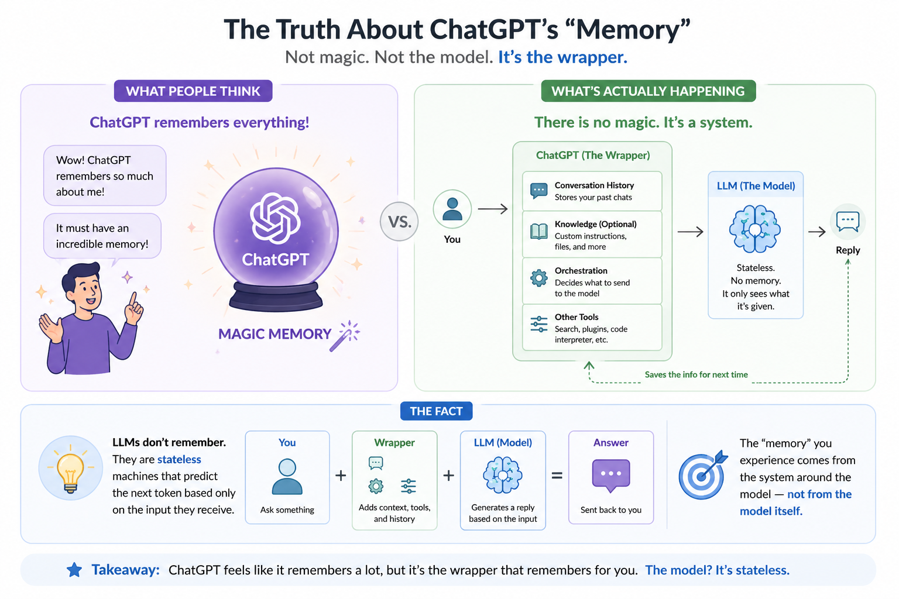
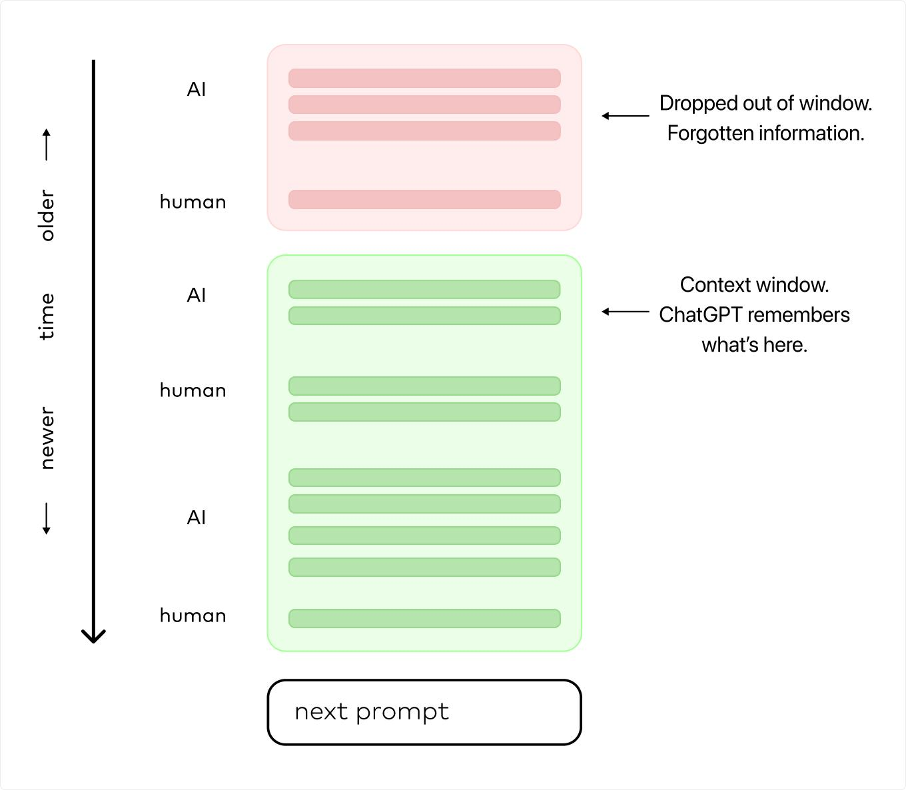
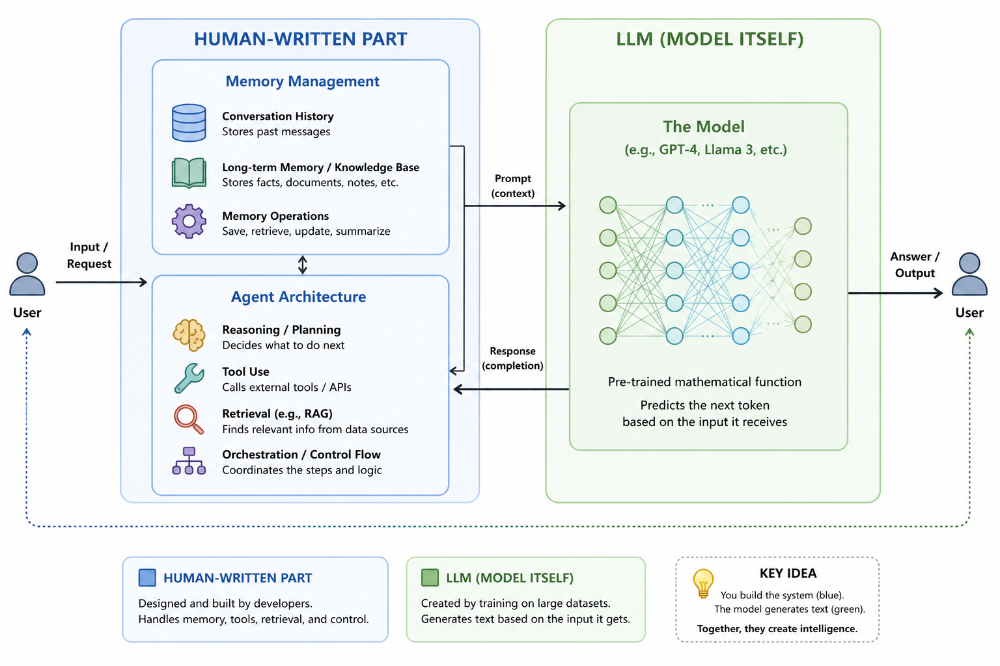
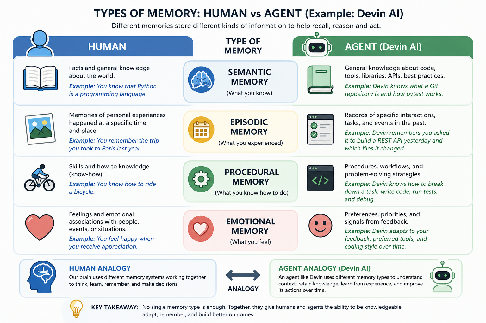
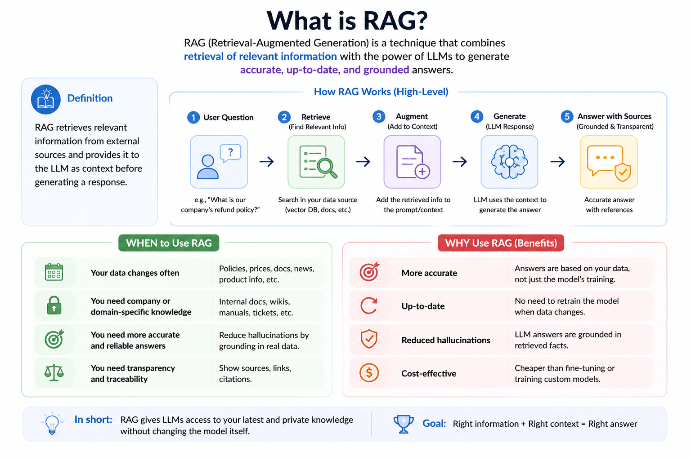
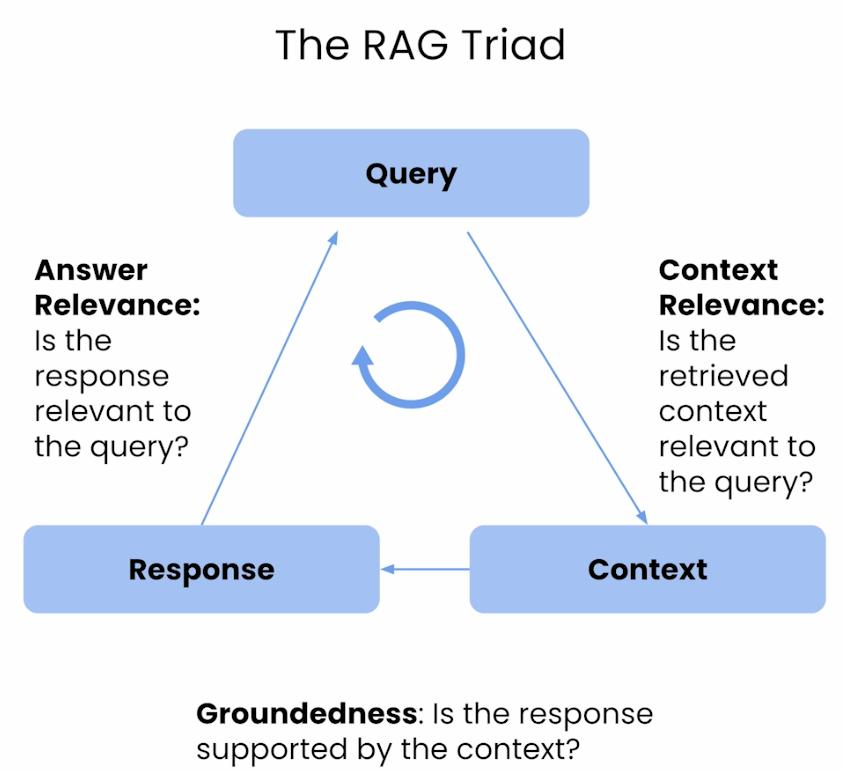

## How LLMs Actually Know Things: From No Memory to RAG

### Real Scenario

> “We asked ChatGPT: *What do you know about me?*”

- Your favourite movie is ...
- Your name is ...

---

### No Memory, No State

- LLM behaves like a function: output = f(input)
- It does **not remember previous interactions** unless they are included in the prompt
- Everything depends on the **context window**

**In simple terms:**
- The model only knows what you send in the request
- If information is not in the prompt → it doesn’t exist for the model

**Analogy:**
> Like a very smart consultant who has no notes and only answers based on what you tell them right now

