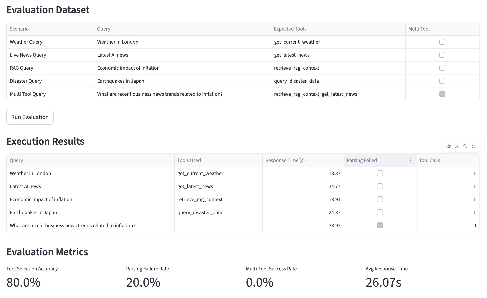

# MCP/RAG Chatbot — Educational Agent Architecture Project

## Overview

This project demonstrates a lightweight AI agent architecture built around:

- MCP-style tool orchestration
- LangGraph state-machine execution
- Retrieval-Augmented Generation (RAG)
- Tool selection and routing
- Evaluation and observability
- Basic LLM security controls
- Streamlit-based interactive UI

The primary goal of this project is education and experimentation, not production deployment.

## Quick Start

### 1. Install Dependencies

```bash
pip install -r requirements.txt
```

### 2. Get OpenRouter API Key

1. Visit https://openrouter.ai/
2. Sign up for a free account
3. Navigate to "Keys" section
4. Create a new API key
5. export OPENROUTER_API_KEY="..."

### 3. Run the App

```bash
streamlit run app.py
```

The app will open in your browser at `http://localhost:8501`

## Assumptions and Scope

### Assumptions

- The application is a demonstration system, not a production enterprise service.
- The LLM provider may return malformed, inconsistent, or non-deterministic outputs.
- Open-weight/local models may produce unstable tool-calling behavior.
- Users interacting with the system may intentionally attempt malformed or adversarial prompts.
- External APIs and network calls are assumed to be unreliable.
- The evaluation framework is educational and heuristic-based rather than academically rigorous.
- Security controls implemented in the project are illustrative defensive layers, not formal guarantees.

### In Scope

- Demonstration of key agentic parts:
  - Tool orchestration
  - LangGraph state-machine execution
  - Retrieval-Augmented Generation (RAG)
  - Tool selection and routing
  - Evaluation and observability
  - Basic security controls

### Out of Scope

- Full enterprise-grade security controls (e.g., authentication, authorization, audit logging)
- Production-grade vector databases 
- Advanced sandboxing or isolation 
- Real-time monitoring infrastructure 
- Distributed orchestration systems 
- GPU optimization and inference serving 
- Large-scale benchmark evaluation 
- Formal guarantees of factual correctness 
- Persistent memory systems 
- Production SLA guarantees

### Scenario

The application integrates multiple tools into a single conversational interface to simulate a lightweight AI assistant capable of orchestrating heterogeneous data sources and retrieval strategies.

The system demonstrates how an LLM agent can dynamically select between:

- real-time API retrieval
- RSS/news aggregation
- semantic vector search (RAG)
- structured analytical querying with Pandas

## Key Components

### Agent Orchestrator

The Agent Orchestrator is the central coordination layer responsible for managing conversational execution flow and tool interaction.

Core responsibilities include:

- Building system prompts dynamically
- Managing conversational state
- Executing reasoning loops
- Detecting and parsing tool calls
- Routing requests to appropriate tools
- Handling iterative tool execution
- Managing final response synthesis
- Applying validation and sanitization layers
- Tracking evaluation metrics and orchestration metadata

The orchestrator operates as a lightweight agent runtime rather than relying on high-level autonomous frameworks.

### LangGraph State Machine

The LangGraph State Machine is a lightweight, declarative framework for orchestrating conversational flows and tool interactions. It provides a structured way to define and manage the execution of conversational agents, ensuring that each step is clearly defined and validated.

Key features include:
- State-based flow definition
- Tool invocation and management
- Iterative reasoning loops
- Response synthesis and validation
- Metrics tracking and orchestration metadata

### MCP Server Layer

The MCP Server Layer is responsible for managing the secure execution environment for the conversational agents. It provides a secure runtime for the agents, ensuring that they operate within strict security boundaries and that sensitive data is handled securely.

Key responsibilities include:
- Secure agent execution environment
- Secure data handling and storage
- Secure communication channels
- Monitoring and logging of agent activity

### RAG Retriever

The Retrieval-Augmented Generation subsystem provides semantic search over historical BBC News data.

The implementation demonstrates a lightweight local RAG architecture using:

- SentenceTransformer embeddings
- FAISS vector indexing
- semantic similarity retrieval

### Observability

Observability is treated as a first-class architectural concern within the project.

The system intentionally exposes internal execution behavior to make agent orchestration transparent and debuggable.

### Security Considerations

The project includes lightweight defensive mechanisms intended to demonstrate foundational LLM security concepts.

These controls are educational and heuristic-based rather than production-grade guarantees.

### Evaluation Framework

Evaluation Framework

The project includes an integrated evaluation framework designed to measure the reliability and orchestration quality of the AI agent system.

The evaluation layer focuses on practical agent-system behavior rather than academic benchmark performance.

The framework executes predefined evaluation scenarios against the full orchestration pipeline and measures:

- tool routing quality
- parsing robustness
- orchestration stability
- execution latency
- multi-tool coordination



### Key Findings

- Open models frequently produce malformed tool calls
- Tool-call parsing requires defensive normalization
- Multi-step orchestration is highly model-sensitive
- Explicit conversational state management significantly improves stability
- Structured logging greatly improves debugging
- Tool-result guidance improves final-answer synthesis

## Summary

- Educational AI agent architecture patterns
- MCP-style tool orchestration
- Lightweight RAG integration
- Agent observability techniques
- Evaluation methodologies
- Security hardening concepts
- Practical orchestration challenges with open models